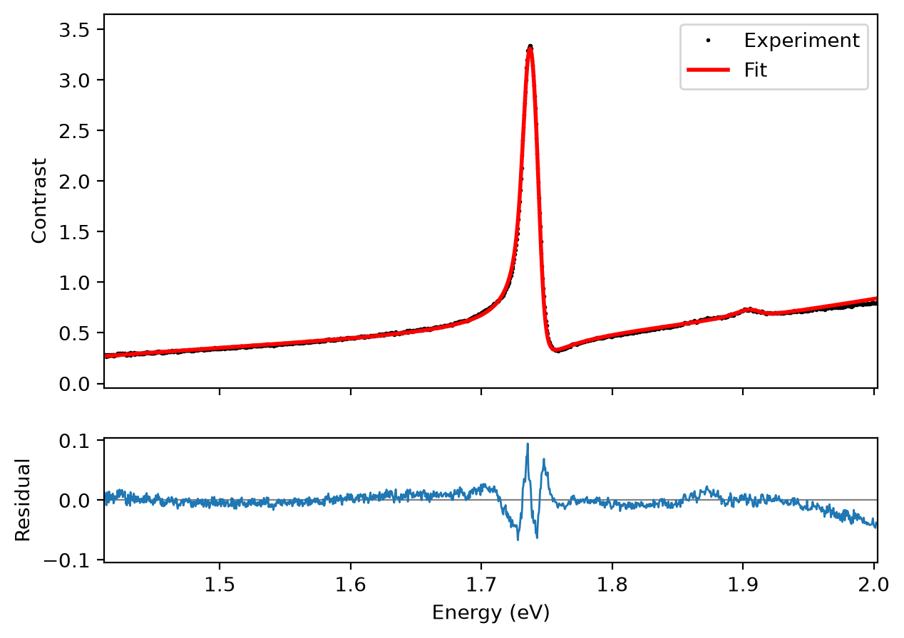
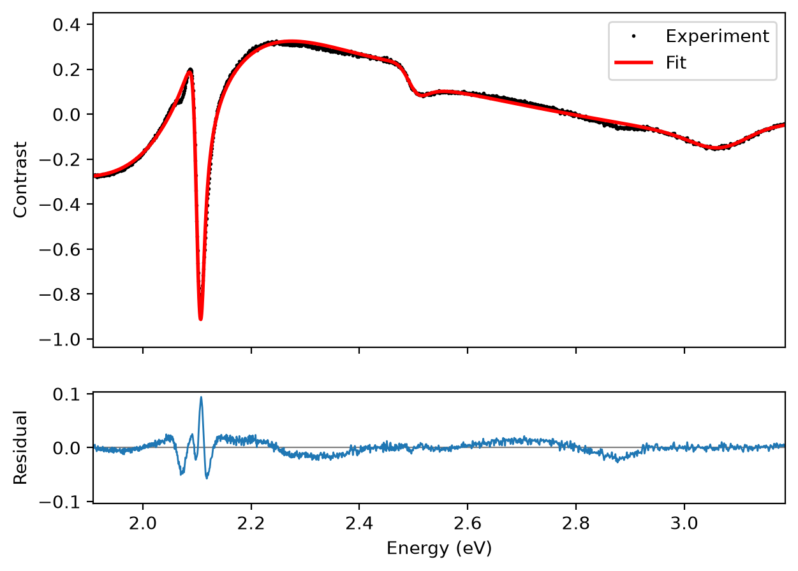

# 2D Material Optical Contrast Fitting Tool (2D材料光学对比度拟合工具)

## 项目简介 (Introduction)

本项目是一个用于分析和拟合二维材料（如 $\text{MoS}_2$, $\text{WS}_2$, $\text{WSe}_2$ 等）光学反射对比度（Optical Contrast）谱的专业工具。它结合了**传输矩阵法 (TMM)** 和 **Faddeeva-Voigt / Lorentz 振子模型**，用于提取激子峰位、振子强度及展宽。

本项目提供两种使用方式，满足不同场景需求：
1.  **Web 版 (Streamlit)**: 无需安装复杂环境，单文件 (`index.html`) 即可运行，支持离线使用，界面现代友好。
2.  **桌面版 (PyQt6)**: 功能最全，适合需要批量处理和深度定制的高级用户。

## 拟合效果展示 (Example Results)

下图展示了实验点、拟合曲线和 residual，可以直观看到模型对强激子峰、色散线形以及慢变背景的拟合效果。

| MoSe2 example | WS2 example |
| --- | --- |
|  |  |

---

## 核心功能 (Key Features)

### 1. 数据处理与可视化
*   **多格式支持**: 兼容 `.csv`, `.txt` 等常见光谱数据格式。
*   **智能单位识别**: 自动识别波长单位（nm）或能量单位（eV），并进行标准化处理。
*   **自动插值对齐**: 自动将样品光谱插值到衬底光谱的波长格点上，确保对比度计算精确。
*   **实时交互绘图**: 拟合过程中实时更新曲线，支持局部放大、数据点查看及高清图片导出。

### 2. 精确的物理模型
*   **多层膜结构 TMM 计算**: 支持任意层厚的堆叠结构计算：
    *   Substrate: Si (支持温度修正), Quartz, Sapphire, TiO2 等。
    *   Dielectric: SiO2, hBN (Top/Bottom 封装层)。
    *   2D Material: 单层或少层样品。
*   **高级光学默认值**: 温度、有限 NA、Si 光学数据源和背景介电常数保留为代码级参数，界面使用稳定默认值。
*   **受控材料插值**: Si 光学常数在 400--1305 nm 内使用保形 PCHIP，区间外使用端点切线线性延拓并保持被动性。
*   **复 Voigt 介电函数（推荐）**: 使用 Faddeeva 函数分别拟合 Lorentz 均匀展宽 $w_L$ 和 Gaussian 非均匀展宽 $w_G$；经典 Lorentz 模型仍可选择。
    
  $$
  \epsilon(E) = \epsilon_\infty + \sum_j \frac{f_j}{E_{0,j}^2 - E^2 - i E \Gamma_j}
    $$

### 3. 先进的拟合算法
*   **量测级多阶段优化**:
    *   **Robust LM (推荐)**: 先用有边界 `soft_l1` Trust Region Reflective 抑制坏点并定位，再通过有界参数变换使用真正的 Levenberg-Marquardt 精修。
    *   **Global + Robust LM**: 先进行差分进化全局初始化，再执行 Robust TRF + LM，适用于初值不确定或多峰耦合情况。
    *   **Derivative + LM**: 先用原始谱预热，再联合拟合原始谱与 Savitzky-Golay 平滑的 $dC/dE$ 或 $d^2C/dE^2$，避免噪声主导。
*   **结构参数联合拟合**: 可联合拟合 SiO2 以及已启用的上/下 hBN 厚度。
*   **任意层堆栈表**: 按入射侧到基底侧逐行设置 `Sample`、hBN、Graphene、SiO2、Quartz、Sapphire 或 TiO2。每层可独立设置厚度、参考区域、是否拟合及拟合上下界，并提供常见封装结构预设。
*   **拟合控制**: 界面保留优化预算和分阶段进度；E0 搜索半宽及背景阶数使用代码默认值。
*   **弱峰保护**: 每个初始共振区域按自身去趋势幅度平衡残差，并报告逐峰局部 $R^2$ 和振幅恢复率，避免高全谱 GOF 掩盖弱峰漏拟合。
*   **引导式操作**: 界面按数据、层结构、拟合设置、共振和结果分步组织；无效操作自动禁用，修改模型或共振后旧拟合自动失效。
*   **可分离慢变背景**: 每次非线性迭代中用线性最小二乘消去三阶慢变漂移，避免将光源/探测器基线误归因于介电函数。
*   **Auto-Guess (自动猜峰)**: 使用 Savitzky-Golay 平滑、低阶背景消除和鲁棒噪声阈值生成初值，并合并同一色散共振产生的相邻峰谷。
*   **参数约束与锁定**: 支持设置参数范围 (Bounds) 和锁定特定参数 (Lock) 不参与拟合。
*   **拟合诊断**: 输出参数标准误差、Jacobian 条件数、RMSE、约化卡方和 Durbin-Watson 残差指标；条件数过大时提示参数不可辨识。

### Example 全谱验收
仓库 WS2 示例在 `1.908--3.187 eV` 全谱上自动识别约 `2.10、2.50、3.06 eV` 三个振子。联合拟合 SiO2 厚度并使用三阶慢变基线后，鲁棒拟合 GOF（$R^2$）回归门槛为 `0.99`；当前三套 Si 数据的基准约为 `0.9944`，4--5 振子模型可进一步达到约 `0.996--0.997`。

### 4. 结果导出
*   **全数据导出**: 将实验对比度、拟合对比度、波长/能量对应数据导出为 CSV。
*   **参数导出**: 将提取的物理参数 ($\epsilon_\infty, f, E_0, \Gamma$) 导出为 CSV 表格。

---

## 快速开始 (Quick Start)

### 方式一：Web 版 (推荐)
**无需安装任何 Python 环境**。
1.  **在线访问**: 点击 [https://reflectance.streamlit.app/](https://reflectance.streamlit.app/) 直接使用。
2.  **或者本地运行**: 直接用浏览器（Chrome/Edge）打开项目根目录下的 `index.html` 文件。

### 方式二：桌面版 (PyQt6)
适合开发人员或需要本地高性能计算的用户。
1.  **环境配置**:
    ```bash
    pip install numpy pandas scipy matplotlib PyQt6
    ```
2.  **运行程序**:
    ```bash
    python gui_app.py
    ```

---

## 使用指南 (Usage Guide)

本工具统一使用相对反射对比度：

$$
C = \frac{R_s - R_0}{R_0}
$$

其中 `R0` 是衬底/参考区域反射强度，`Rs` 是样品区域反射强度。输入文件建议为两列数值：第一列为波长 nm 或能量 eV，第二列为反射强度或已经处理好的对比度。

### 网页版：一步一步操作

适用于 Streamlit Cloud 或本地打开 `index.html`。

#### 1. 上传实验数据
1. 打开网页应用。
2. 在左侧栏找到 **1. Experimental Data**。
3. 点击 **Upload Substrate Spectrum (Ref)**，选择空白衬底/参考区域的光谱。
4. 点击 **Upload Sample Spectrum**，选择样品区域光谱。
5. 等待界面显示 `Data ready`。程序会自动判断第一列是 nm 还是 eV，并把样品光谱插值到参考光谱网格上，然后计算 `(Rs - R0) / R0`。

#### 2. 设置层结构和物理模型
1. 找到 **2. Layer Stack & Model**。
2. 在 **Structure preset** 中选择常用结构，例如：
   - `Sample / SiO2 / Si`：二维材料在氧化硅/硅上。
   - `hBN / Sample / hBN / SiO2 / Si`：hBN 封装样品。
   - `Sample / Quartz`：石英衬底样品。
3. 点击 **Apply**，用预设替换当前层表。
4. 在层表中逐行编辑：
   - **Order**：从入射侧到衬底侧的顺序。
   - **Material**：选择 `Sample`、`hBN`、`Graphene`、`SiO2`、`Quartz`、`Sapphire` 或 `TiO2`。
   - **Thickness (nm)**：该层厚度。
   - **In reference**：勾选表示参考区域也包含该层；`Sample` 会自动不计入参考区域。
   - **Fit**：勾选表示拟合该层厚度。
   - **Min (nm)** / **Max (nm)**：厚度拟合上下界。
5. 在 **Semi-infinite substrate** 中选择半无限衬底：`Si`、`Quartz`、`Sapphire` 或 `TiO2`。
6. 在 **Exciton line shape** 中选择模型：
   - **Voigt / Faddeeva (Recommended)**：推荐，分别拟合均匀展宽 `wL` 和非均匀展宽 `wG`。
   - **Lorentz**：更简单，只使用一个 Lorentz 线宽。

#### 3. 设置 ROI 和拟合算法
1. 在左侧栏找到 **3. Fit Setup**。
2. 输入 **ROI Min (eV)** 和 **ROI Max (eV)**，限定拟合能量范围。
3. 查看 ROI 提示。如果 ROI 无效或点数太少，**Auto Guess** 和 **Run Fit** 会自动禁用。
4. 选择 **Method**：
   - **Robust LM (Recommended)**：默认推荐，适合大多数谱。
   - **Global + Robust LM**：初始峰位不确定或多峰耦合严重时使用，速度较慢。
   - **1st Derivative + LM** / **2nd Derivative + LM**：作为弱峰或重叠峰的辅助检查模式，已用内置 WSe2 示例做回归测试。
5. 设置 **Optimization budget**：
   - `3000`：快速测试。
   - `8000`：普通拟合。
   - `15000`：较难拟合或全局搜索时使用。

#### 4. 添加或自动猜测激子峰
1. 找到 **4. Exciton Resonances**。
2. 点击 **Auto Guess**，程序会在 ROI 内自动找峰。算法会处理慢变背景，并用局部背景补漏弱峰。
3. 点击 **Add Resonance** 可以手动增加一个振子。
4. 在表格中输入或修改参数：
   - **f (eV²)**：振子强度，必须 `>= 0`。
   - **E0 (eV)**：峰位，必须为正。
   - **wL (eV)**：Lorentz FWHM，必须为正。
   - **wG (eV)**：Gaussian FWHM，仅 Voigt/Faddeeva 模型使用，必须为正。
   - 参数旁边的 **锁定框**：勾选后该参数固定，不参与拟合。
5. 点击 **Clear** 可以清空全部振子。

#### 5. 运行拟合
1. 确认数据已上传、ROI 有效、至少有一个振子、层结构没有错误。
2. 点击 **Run Fit**。
3. 观察进度提示：
   - 校验层结构和参数。
   - 导数模式下先进行原始谱 warm start。
   - 优化光学参数和可拟合层厚。
   - 计算不确定度和诊断指标。
4. 如果之后修改数据、ROI、模型、层结构或振子表，旧拟合会自动失效，需要重新点击 **Run Fit**。

#### 6. 查看拟合结果
1. 在 **Fit Results** 中先看：
   - **Global R2**
   - **RMSE**
   - **Durbin-Watson**
   - 拟合方法和 Jacobian 条件数
2. 再看 **Per-resonance diagnostics**：
   - **Local R2**：每个峰附近的局部拟合质量。
   - **Amplitude ratio**：拟合峰幅度 / 实验峰幅度。
   - 如果全局 R2 很高但局部峰没拟合好，会出现 warning。
3. 在 **5. Spectrum & Fit** 中查看图：
   - 上图：实验点和拟合曲线。
   - 下图：残差 `experiment - fit`。

#### 7. 导出结果
在 **Fit Results** 的 **Export** 区域点击：
1. **Download Fitted Spectrum (CSV)**：导出能量、波长、实验对比度、拟合对比度、纯物理模型、baseline 和 residual。
2. **Download Resonance Diagnostics (CSV)**：导出逐峰 local R2、amplitude ratio、质量标记和问题标签。
3. **Download Fit Parameters (CSV)**：导出振子参数、标准误差和拟合得到的层厚。

### 桌面版：一步一步操作

适用于运行 `gui_app.py` 的 PyQt6 桌面程序。

#### 1. 启动桌面程序
1. 安装依赖：
   ```bash
   pip install numpy pandas scipy matplotlib PyQt6
   ```
2. 运行：
   ```bash
   python gui_app.py
   ```

#### 2. 载入数据
1. 在 **1. Experimental Data** 中点击 **Choose Reference Spectrum...**，选择衬底/参考区域光谱。
2. 点击 **Choose Sample Spectrum...**，选择样品区域光谱。
3. 状态栏显示数据已就绪后，点击 **Plot Data Preview** 预览计算出的相对对比度。

#### 3. 设置层结构
1. 在 **2. Layer Stack (incident side -> substrate)** 中选择 **Substrate**。
2. 选择 **Structure Preset**，点击 **Apply Preset**。
3. 在层表中编辑：
   - **Material**：层材料。
   - **Thickness**：厚度 nm。
   - **Ref**：参考区域是否包含该层。
   - **Fit**：是否拟合该层厚度。
   - **Min/Max**：厚度拟合上下界。
4. 使用 **Add Layer**、**Remove**、**Move Up**、**Move Down** 组合任意层结构。层顺序同样是从入射侧到衬底侧。

#### 4. 设置拟合选项
1. 在 **3. Fit Setup** 中设置 ROI Min / ROI Max。
2. 选择 **Fit Method**：
   - **Robust LM (Recommended)**：默认推荐。
   - **Global + Robust LM**：初值不确定时使用。
   - **1st Derivative + LM** / **2nd Derivative + LM**：弱峰或重叠峰辅助检查。
3. 选择 **Line Shape**：
   - **Voigt / Faddeeva (Recommended)**：推荐。
   - **Lorentz**：更简单的 Lorentz 模型。
4. NA、温度、背景介电常数、E0 搜索半宽、baseline 阶数等高级参数默认隐藏或作为代码级默认值，普通使用不需要改。

#### 5. 设置激子表
1. 在 **4. Exciton Resonances** 中点击 **Auto Guess from ROI**，用 ROI 内自动识别的峰替换表格。
2. 点击 **Add Exciton** 手动添加振子。
3. 选中一行后点击 **Remove Selected** 删除振子。
4. 编辑列：
   - **f**：振子强度，必须 `>= 0`。
   - **E0**：峰位 eV，必须为正。
   - **wL**：Lorentz FWHM，必须为正。
   - **wG**：Voigt 模型中的 Gaussian FWHM，必须为正。
   - **Lock**：锁定对应参数。
5. 如果输入负强度、负线宽或非正峰位，桌面版会在拟合前提示具体错误行。

#### 6. 运行和查看拟合
1. 点击 **Start Fitting**。
2. 等待进度条完成。
3. 拟合完成后图像和振子表会更新。
4. 结果弹窗会显示：
   - Global R2 / RMSE
   - Jacobian 条件数
   - Durbin-Watson
   - 拟合层厚及误差
   - 逐峰 local diagnostics
   - 每个峰的 E0、线宽和标准误差

#### 7. 保存和导出
1. 点击 **Save Plot**，保存当前图为 PNG、JPG 或 PDF。
2. 点击 **Export Data**，导出绘图/拟合数据为 CSV 或 TXT。
3. 如果需要更完整的 resonance diagnostics CSV，建议使用 Web 版导出。

---
## 文件结构说明
*   `index.html`: Web 版主程序（包含前端和嵌入的 Python 逻辑），单文件部署。
*   `gui_app.py`: 桌面版主程序入口 (PyQt6)。
*   `streamlit_app.py`: Web 版的 Python 源码（开发用，已编译进 index.html）。
*   `materials.py`: 核心材料折射率库和处理逻辑。
*   `Si_data.csv`: 默认的硅折射率数据源。
*   `Schinke.csv`, `Green-2008.csv`: 可选的分段 `wl,n` / `wl,k` Si 光学常数。
*   `example_benchmark.py`: example 全谱模型与 Si 数据源基准工具。

# English Version

## Introduction

This project fits 2D-material optical-contrast spectra with a transfer-matrix model and selectable complex Faddeeva-Voigt or Lorentz oscillators.

The tool offers two modes of operation:
1.  **Web Version (Streamlit)**: Runs directly in a browser via a single HTML file (`index.html`) without complex installation. Includes a modern, user-friendly interface.
2.  **Desktop Version (PyQt6)**: A full-featured desktop application suitable for batch processing and advanced customization.

## Key Features

### 1. Data Processing & Visualization
*   **Multi-Format Support**: Compatible with common formats like `.csv` and `.txt`.
*   **Smart Unit Recognition**: Automatically detects and standardizes wavelength (nm) or energy (eV) units.
*   **Auto-Interpolation**: Automatically interpolates sample spectra onto the substrate's wavelength grid for precise contrast calculation.
*   **Interactive Plotting**: Real-time updates during fitting, with support for zooming, data inspection, and high-quality image export.

### 2. Precise Physical Modeling
*   **Multi-Layer TMM Calculation**: Supports arbitrary stack structures:
    *   Substrate: Si (with temp correction), Quartz, Sapphire, TiO2, etc.
    *   Dielectric: SiO2, hBN (Top/Bottom encapsulation).
    *   2D Material: Monolayer or few-layer samples.
*   **Advanced Optical Defaults**: temperature, finite NA, Si optical source, and background epsilon remain code-level parameters while the UI uses stable defaults.
*   **Controlled Interpolation**: Si uses shape-preserving PCHIP in 400--1305 nm and passive endpoint-tangent linear extrapolation outside that range.
*   **Complex Voigt Dielectric Function (recommended)**: Faddeeva oscillators separate Lorentzian homogeneous width $w_L$ from Gaussian inhomogeneous width $w_G$; the classical Lorentz model remains available. Oscillator inputs are constrained to passive, physical values (`f >= 0`, `E_0 > 0`, positive linewidths).
  
  $$  
    \epsilon(E) = \epsilon_\infty + \sum_j \frac{f_j}{E_{0,j}^2 - E^2 - i E \Gamma_j}
    $$

### 3. Advanced Fitting Algorithms
*   **Metrology-oriented staged solver**:
    *   **Robust LM**: bounded soft-L1 TRF localization followed by true Levenberg-Marquardt refinement through bounded parameter transforms.
    *   **Global + Robust LM**: Differential Evolution initialization followed by robust TRF and LM.
    *   **Derivative + LM**: warm-starts on the original spectrum, then jointly fits the spectrum and smoothed first or second energy derivative.
*   **Joint Structure Fit**: optionally fits SiO2 and enabled top/bottom hBN thicknesses.
*   **Arbitrary Layer Table**: order Sample, hBN, Graphene, SiO2, Quartz, Sapphire, and TiO2 layers from the incident side to the substrate. Each row controls thickness, reference-region inclusion, fit state, and bounds.
*   **Fit Controls**: the UI exposes the optimization budget and staged progress; E0 search width and baseline order use code defaults.
*   **Weak-feature preservation**: resonance neighborhoods are balanced by their own detrended amplitudes and receive per-peak local $R^2$ and amplitude-recovery diagnostics.
*   **Guided workflow**: data, layer stack, fit setup, resonances, and results are organized as explicit steps; unavailable actions are disabled and stale fits are invalidated automatically.
*   **Variable-projection baseline**: cubic slow measurement drift is separated from nonlinear dielectric parameters.
*   **Auto-Guess**: smoothed, detrended, noise-adaptive initialization that merges the peak/dip pair of one dispersive resonance. A secondary local-background pass helps recover weak peaks on curved interference backgrounds while filtering side-lobe duplicates near stronger peaks.
*   **Constraints & Locking**: Supports parameter bounds and locking specific parameters (e.g., fixing a known peak position) during fitting.
*   **Fit Diagnostics**: parameter standard errors, Jacobian condition number, RMSE, reduced chi-square, Durbin-Watson residual statistics, per-resonance local $R^2$, amplitude-recovery ratio, and warnings when a high global $R^2$ hides a missed local feature.

### Full-spectrum example acceptance
The WS2 example automatically initializes oscillators near `2.10`, `2.50`, and `3.06 eV`. Joint SiO2-thickness fitting with a cubic slow baseline has a full-range GOF ($R^2$) regression threshold of `0.99`; all three bundled Si datasets benchmark near `0.9944`, while 4--5 oscillators reach approximately `0.996--0.997`.

### 4. Export Results
*   **Data Export**: Download energy, wavelength, experimental contrast, fitted contrast, physical-only model, fitted baseline, and residual (`experiment - fit`) as CSV.
*   **Resonance Diagnostics Export**: Download per-resonance local $R^2$, amplitude ratio, quality flag, and issue labels as CSV.
*   **Parameter Export**: Download extracted physical parameters ($\epsilon_\infty, f, E_0, \Gamma$ or $w_L/w_G$) and fitted layer thicknesses as CSV.

---

## Quick Start

### Option 1: Web Version (Recommended)
**No Python environment required.**
1.  **Online**: Visit [https://reflectance.streamlit.app/](https://reflectance.streamlit.app/).
2.  **Local Run**: Simply open the `index.html` file in your browser (Chrome/Edge).

### Option 2: Desktop Version (PyQt6)
For developers or high-performance local computing.
1.  **Setup Environment**:
    ```bash
    pip install numpy pandas scipy matplotlib PyQt6
    ```
2.  **Run Application**:
    ```bash
    python gui_app.py
    ```

---

## Usage Guide

The fitted contrast definition is always

$$
C = \frac{R_s - R_0}{R_0}
$$

where `R0` is the reference/substrate-region reflectance and `Rs` is the sample-region reflectance. Input files should contain two numeric columns: wavelength in nm or photon energy in eV, and reflected intensity or contrast.

### Web Version: Step-by-Step Operation

Use this workflow for Streamlit Cloud or the local `index.html` web interface.

#### 1. Load Experimental Data
1. Open the web app.
2. In the left sidebar, find **1. Experimental Data**.
3. Click **Upload Substrate Spectrum (Ref)** and choose the reference spectrum from the bare substrate/reference region.
4. Click **Upload Sample Spectrum** and choose the spectrum from the 2D-material/sample region.
5. Wait for the message `Data ready`. The app automatically detects whether the first column is wavelength or energy, interpolates the sample spectrum to the reference grid, and computes `(Rs - R0) / R0`.

#### 2. Set the Layer Stack and Optical Model
1. Go to **2. Layer Stack & Model**.
2. Pick a **Structure preset**. Typical choices are:
   - `Sample / SiO2 / Si` for monolayer material on oxide/Si.
   - `hBN / Sample / hBN / SiO2 / Si` for encapsulated samples.
   - `Sample / Quartz` for transparent quartz substrates.
3. Click **Apply** to replace the current layer table with the preset.
4. Edit the layer table row by row:
   - **Order**: incident side to substrate side.
   - **Material**: choose `Sample`, `hBN`, `Graphene`, `SiO2`, `Quartz`, `Sapphire`, or `TiO2`.
   - **Thickness (nm)**: physical layer thickness.
   - **In reference**: checked means this layer is also present in the reference-region stack.
   - **Fit**: checked means this thickness is fitted.
   - **Min (nm)** and **Max (nm)**: bounds for fitted layer thickness.
5. In **Optical model**, choose **Semi-infinite substrate** (`Si`, `Quartz`, `Sapphire`, or `TiO2`).
6. Choose **Exciton line shape**:
   - **Voigt / Faddeeva (Recommended)** separates homogeneous `wL` and inhomogeneous `wG` broadening.
   - **Lorentz** uses one homogeneous linewidth.

#### 3. Set ROI and Solver
1. In the sidebar, go to **3. Fit Setup**.
2. Set **ROI Min (eV)** and **ROI Max (eV)** around the spectral region to fit.
3. Check the ROI message. The app disables Auto Guess and Run Fit if the ROI is invalid or contains too few points.
4. Choose **Method**:
   - **Robust LM (Recommended)**: default for most spectra.
   - **Global + Robust LM**: slower, useful when initial guesses are poor.
   - **1st Derivative + LM** or **2nd Derivative + LM**: useful as auxiliary modes for weak or overlapping features; these modes are regression-tested on the bundled WSe2 examples.
5. Choose **Optimization budget**. Use `8000` for normal work, `15000` for hard fits, and `3000` for quick tests.

#### 4. Add or Guess Exciton Resonances
1. Go to **4. Exciton Resonances**.
2. Click **Auto Guess** to detect resonances inside the ROI. The algorithm uses smoothed/global detrending plus a local-background pass to recover weak peaks on curved backgrounds.
3. Click **Add Resonance** to add a manual oscillator.
4. Edit the table:
   - **f (eV²)**: oscillator strength. Must be non-negative.
   - **E0 (eV)**: resonance energy.
   - **wL (eV)**: Lorentzian FWHM.
   - **wG (eV)**: Gaussian FWHM, shown for Voigt/Faddeeva.
   - **lock checkbox** next to a parameter: keep that parameter fixed during fitting.
5. Use **Clear** to remove all resonances and start over.

#### 5. Run the Fit
1. Confirm that files are loaded, the ROI is valid, at least one resonance exists, and the layer stack has no error.
2. Click **Run Fit**.
3. Watch the progress messages:
   - parameter validation,
   - optional warm start for derivative modes,
   - nonlinear optical/layer optimization,
   - uncertainty and diagnostics calculation.
4. If model, layer, ROI, data, or resonance settings change later, the old fit is invalidated and the app asks you to run fitting again.

#### 6. Read Results
1. In **Fit Results**, check:
   - **Global R2**,
   - **RMSE**,
   - **Durbin-Watson**,
   - method name and Jacobian condition number.
2. Check **Per-resonance diagnostics**:
   - **Local R2** measures local shape agreement near each requested peak.
   - **Amplitude ratio** measures fitted/measured local feature amplitude.
   - A warning appears if global R2 is high but a local exciton feature is weakly fitted or amplitude-mismatched.
3. In **5. Spectrum & Fit**, inspect:
   - top panel: experiment and fitted curve,
   - bottom panel: residual `experiment - fit`.

#### 7. Export Results
Use the buttons in **Fit Results**:
1. **Download Fitted Spectrum (CSV)** exports energy, wavelength, experimental contrast, fitted contrast, physical-only model, fitted baseline, and residual.
2. **Download Resonance Diagnostics (CSV)** exports per-resonance local R2, amplitude ratio, quality flag, and issue label.
3. **Download Fit Parameters (CSV)** exports oscillator parameters, standard errors, and fitted layer thicknesses.

### Desktop Version: Step-by-Step Operation

Use this workflow for `gui_app.py`.

#### 1. Start the Desktop App
1. Install dependencies:
   ```bash
   pip install numpy pandas scipy matplotlib PyQt6
   ```
2. Run:
   ```bash
   python gui_app.py
   ```

#### 2. Load Data
1. In **1. Experimental Data**, click **Choose Reference Spectrum...** and select the substrate/reference file.
2. Click **Choose Sample Spectrum...** and select the sample file.
3. The status line should indicate that data is ready.
4. Click **Plot Data Preview** in **5. Run & Export** to inspect the computed relative contrast.

#### 3. Configure the Layer Stack
1. In **2. Layer Stack (incident side -> substrate)**, choose **Substrate**.
2. If needed, choose a Si data source from the hidden/advanced Si-source control; default settings are recommended for normal use.
3. Choose a **Structure Preset** and click **Apply Preset**.
4. Edit the layer table:
   - **Material**: select the layer material.
   - **Thickness**: enter thickness in nm.
   - **Ref**: include this layer in the reference stack.
   - **Fit**: fit this layer thickness.
   - **Min/Max**: bounds for thickness fitting.
5. Use **Add Layer**, **Remove**, **Move Up**, and **Move Down** to build arbitrary stacks. The row order is incident side to substrate.

#### 4. Configure Fit Setup
1. In **3. Fit Setup**, set **ROI Min** and **ROI Max** in eV.
2. Choose **Fit Method**:
   - **Robust LM (Recommended)** for routine fitting.
   - **Global + Robust LM** for uncertain initial guesses.
   - **1st Derivative + LM** or **2nd Derivative + LM** for auxiliary derivative-domain checks.
3. Choose **Line Shape**:
   - **Voigt / Faddeeva (Recommended)** for separate `wL` and `wG`.
   - **Lorentz** for a simpler homogeneous linewidth model.
4. Keep hidden advanced defaults such as NA, temperature, background epsilon, E0 margin, and baseline order unless you are editing code-level behavior.

#### 5. Enter Resonances
1. In **4. Exciton Resonances**, click **Auto Guess from ROI** to replace the table with detected peaks.
2. Click **Add Exciton** to add a manual oscillator.
3. Select a row and click **Remove Selected** to delete it.
4. Edit columns:
   - **f**: oscillator strength, must be non-negative.
   - **E0**: peak energy in eV, must be positive.
   - **wL**: Lorentzian FWHM in eV, must be positive.
   - **wG**: Gaussian FWHM in eV for Voigt, must be positive.
   - **Lock** columns: fix the parameter during fitting.
5. The desktop app rejects nonphysical resonance inputs before fitting and reports the invalid row.

#### 6. Run and Inspect Fit
1. Click **Start Fitting**.
2. Wait for the progress bar to finish.
3. The fit updates the plot and resonance table.
4. Read the result dialog:
   - global R2 and RMSE,
   - Jacobian condition number,
   - Durbin-Watson residual statistic,
   - fitted layer thicknesses,
   - per-peak local diagnostics,
   - fitted oscillator parameters and standard errors.

#### 7. Save or Export
1. Click **Save Plot** to export the current figure as PNG, JPG, or PDF.
2. Click **Export Data** to save the plotted/fitted data as CSV or TXT.
3. Use the result dialog values for quick reporting; use the Web version when you need the richer resonance-diagnostics CSV exports.

---

## File Structure
*   `index.html`: Web version (contains frontend + embedded Python), single-file deployment.
*   `gui_app.py`: Desktop application entry point (PyQt6).
*   `streamlit_app.py`: Source code for the Web version (compiled into index.html).
*   `optical_model.py`: TMM, Faddeeva-Voigt/Lorentz dielectric functions, finite-NA averaging, and contrast definition.
*   `fitting_engine.py`: Robust TRF, bounded LM, baseline projection, uncertainty, and diagnostics.
*   `sync_index.py`: Synchronizes Python sources into the standalone stlite HTML file.
*   `materials.py`: Core material library and physics logic.
*   `Si_data.csv`: Default Silicon refractive index data.
*   `Schinke.csv`, `Green-2008.csv`: Optional segmented `wl,n` / `wl,k` Si optical constants.
*   `example_benchmark.py`: Full-spectrum example and Si-source benchmark utility.
