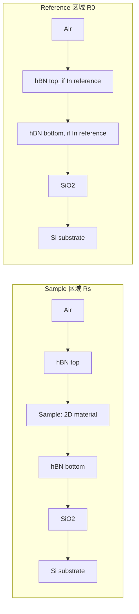
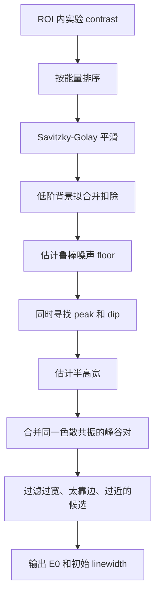
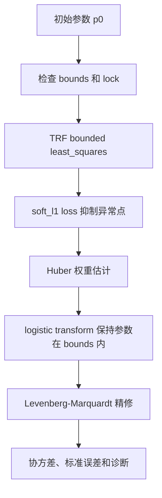

# 物理模型与拟合算法说明

本文档说明本工具如何从 reference / sample 光谱得到 optical contrast，如何用多层膜 TMM 和激子介电函数生成物理模型，以及拟合算法如何处理初值、约束、慢变背景、弱峰和诊断指标。

适合阅读对象：

- 想知道拟合曲线是怎么来的实验用户。
- 想判断参数是否可信的数据分析用户。
- 想继续改底层模型或拟合算法的开发者。

---

## 1. 总体流程

工具的目标是拟合二维材料样品区域相对于参考区域的反射对比度：

$$
C(E)=\frac{R_s(E)-R_0(E)}{R_0(E)}
$$

其中：

- \(R_s\)：sample 区域反射强度，包含二维材料层。
- \(R_0\)：reference 区域反射强度，不包含 `Sample`，但可以包含 hBN、Graphene、SiO2 等 reference 区域实际存在的层。
- \(E\)：光子能量，单位 eV。

整体处理流程如下：

```mermaid
flowchart TD
    A[导入 reference 光谱 R0] --> C[单位识别与数据清洗]
    B[导入 sample 光谱 Rs] --> C
    C --> D[插值到同一波长/能量网格]
    D --> E[计算实验对比度 C=(Rs-R0)/R0]
    E --> F[设置层结构与 reference inclusion]
    F --> G[选择 Lorentz 或 Voigt 激子介电函数]
    G --> H[Auto Guess 或手动输入激子初值]
    H --> I[构建 TMM sample/reference 模型]
    I --> J[非线性拟合 + baseline variable projection]
    J --> K[输出拟合曲线、残差、参数、局部峰诊断]
```

代码入口主要对应：

- `optical_model.py`：多层膜 TMM、激子介电函数、层结构解析、finite-NA 代码级支持。
- `fitting_engine.py`：自动猜峰、鲁棒拟合、变量投影 baseline、导数拟合、误差和诊断。
- `streamlit_app.py` / `gui_app.py`：Web 和桌面端界面逻辑。

---

## 2. 数据处理

### 2.1 输入格式

推荐输入两列数值：

| 第 1 列 | 第 2 列 |
| --- | --- |
| 波长 nm 或能量 eV | 反射强度、光谱强度或已处理后的信号 |

程序会自动判断第一列更像波长还是能量。若第一列是波长 \(\lambda\)，则转换为：

$$
E=\frac{hc}{\lambda}
$$

代码中使用：

$$
hc = 1239.8419843320026 \ \mathrm{eV \cdot nm}
$$

### 2.2 Reference / Sample 对齐

实验中 reference 和 sample 光谱的采样点可能略有不同。工具会把 sample 光谱插值到 reference 的网格上，然后计算：

$$
C_\mathrm{exp}=\frac{R_s-R_0}{R_0}
$$

这样可以避免直接逐点相除导致的波长错位误差。

---

## 3. 层结构模型

### 3.1 表格含义

层结构表从入射侧到衬底侧排列：

| 列名 | 含义 |
| --- | --- |
| `Material` | 层材料，例如 `hBN`、`Graphene`、`Sample`、`SiO2`、`Si` |
| `Thickness (nm)` | 有限厚度层的物理厚度 |
| `In reference` | reference 区域是否包含该层 |
| `Fit` | 是否拟合该层厚度 |
| `Min / Max` | 厚度拟合上下界 |

最后一行若是零厚度 `Si`、`Quartz`、`Sapphire` 或 `TiO2`，表示半无限衬底。这一行不作为有限厚度薄膜传播矩阵处理，而是作为出射介质。

### 3.2 Sample 与 Reference 两套结构

同一张层表会生成两套堆栈：

- **Sample stack**：包含所有有限厚度层，包括 `Sample`。
- **Reference stack**：只包含勾选 `In reference` 的有限厚度层，且强制排除 `Sample`。

例如 hBN 封装样品：



这样比固定假设 “reference = bare substrate” 更适合实际样品，因为 reference 区域可能也有 hBN、Graphene 或同一片 SiO2。

---

## 4. 多层膜 TMM

### 4.1 传播矩阵

对每个有限厚度层 \(j\)，折射率为 \(n_j\)，厚度为 \(d_j\)。在给定角度和偏振下，法向波矢分量为：

$$
k_{z,j} \propto \sqrt{n_j^2-\sin^2\theta_0}
$$

层内相位：

$$
\delta_j=\frac{2\pi}{\lambda} k_{z,j} d_j
$$

特征矩阵写成：

$$
M_j=
\begin{pmatrix}
\cos\delta_j & -i\sin\delta_j/Y_j \\
-iY_j\sin\delta_j & \cos\delta_j
\end{pmatrix}
$$

其中导纳 \(Y_j\) 对 s / p 偏振不同：

$$
Y_j^{(s)} = k_{z,j}
$$

$$
Y_j^{(p)} = \frac{n_j^2}{k_{z,j}}
$$

总矩阵为：

$$
M=\prod_j M_j
$$

然后由入射介质导纳、出射衬底导纳和总矩阵得到反射振幅 \(r\)，反射率为：

$$
R=|r|^2
$$

工具分别计算：

$$
R_s = R(\mathrm{sample\ stack})
$$

$$
R_0 = R(\mathrm{reference\ stack})
$$

最终输出：

$$
C_\mathrm{model}=\frac{R_s-R_0}{R_0}
$$

### 4.2 复折射率与 branch handling

当材料有吸收时，折射率是复数：

$$
n=n'+in''
$$

复数平方根有两个分支。如果选错，可能出现光场在吸收介质中随深度增长的非物理结果。当前底层使用 `forward_normal_wavevector()` 统一处理：

- 吸收介质中选择 \(\operatorname{Im}(k_z)\ge 0\) 的分支，使场随深度衰减。
- 无吸收介质中选择 \(\operatorname{Re}(k_z)\ge 0\) 的分支，使波向前传播。

这部分是借鉴通用 TMM 工具的严谨处理方向，但仍保持本工具面向 2D optical contrast fitting 的专用界面。

### 4.3 Finite NA

代码层保留了有限 NA 的角度平均：

```text
NA = sin(theta_max)
```

若 `numerical_aperture > 0`，程序在 \(0 \le \sin^2\theta \le NA^2\) 上做 Legendre 积分，并平均 s / p 偏振。

当前 UI 默认隐藏 NA，并使用 `NA = 0` 的正入射近似。原因是实际显微反射中的照明分布、偏振、焦平面和收集几何并不一定等价于简单均匀 pupil 平均。对于常规拟合，先保持稳定的正入射模型更可靠。

---

## 5. 激子介电函数

二维材料层 `Sample` 的折射率由介电函数给出：

$$
n_\mathrm{2D}(E)=\sqrt{\epsilon(E)}
$$

工具支持两种线型。

### 5.1 Lorentz 模型

Lorentz 模型形式：

$$
\epsilon(E)=\epsilon_b+\sum_j
\frac{f_j}{E_{0,j}^2-E^2-iE\Gamma_j}
$$

参数含义：

| 参数 | 含义 |
| --- | --- |
| \(\epsilon_b\) | 背景介电常数 |
| \(f_j\) | 第 \(j\) 个振子的强度 |
| \(E_{0,j}\) | 共振能量，单位 eV |
| \(\Gamma_j\) | Lorentz FWHM / 均匀展宽，单位 eV |

约束：

$$
f_j \ge 0,\quad E_{0,j}>0,\quad \Gamma_j>0
$$

Lorentz 模型参数少、速度快，但无法区分均匀和非均匀展宽。

### 5.2 Voigt / Faddeeva 模型

推荐模型是复 Voigt / Faddeeva 介电函数。它把 Lorentz 均匀展宽和 Gaussian 非均匀展宽分开：

| 参数 | 含义 |
| --- | --- |
| \(f_j\) | 振子强度 |
| \(E_{0,j}\) | 共振能量 |
| \(w_{L,j}\) | Lorentz FWHM，均匀展宽 |
| \(w_{G,j}\) | Gaussian FWHM，非均匀展宽 |

代码使用 Faddeeva 函数 `wofz` 计算复 Voigt 响应：

$$
\epsilon(E)=\epsilon_b+\sum_j f_j
\frac{2i\sqrt{\pi\ln 2}}{w_{G,j}}
w(z_j)
$$

其中 \(w(z)\) 是 Faddeeva 函数，\(z_j\) 包含 \(E-E_{0,j}\)、\(w_L\) 和 \(w_G\)。这个模型更接近很多 TMD 激子线型的实际展宽机制。

约束：

$$
f_j \ge 0,\quad E_{0,j}>0,\quad w_{L,j}>0,\quad w_{G,j}>0
$$

---

## 6. Auto Guess 自动猜峰

Auto Guess 的目标不是最终拟合，而是给非线性拟合一个合理初值。流程如下：



这样做的原因是 optical contrast 的激子不一定表现为简单吸收峰。由于多层干涉，单个激子可能表现为峰、谷或色散型峰谷组合。

自动猜峰会：

- 去掉慢变干涉背景，减少背景曲率影响。
- 同时找正峰和负峰。
- 合并距离很近、可能来自同一个色散共振的 peak / dip。
- 通过局部背景二次检查恢复弱峰。
- 过滤过宽候选，避免把慢变基线当成激子。

---

## 7. 拟合参数向量

拟合参数由三部分组成。

### 7.1 介电函数参数

Lorentz：

```text
[eps_b, f1, E01, gamma1, f2, E02, gamma2, ...]
```

Voigt：

```text
[eps_b, f1, E01, wL1, wG1, f2, E02, wL2, wG2, ...]
```

### 7.2 可拟合层厚

层表中 `Fit=True` 的层厚会追加到拟合变量中。例如 SiO2 或 hBN 厚度未知时，可以联合拟合。

### 7.3 Baseline 参数

慢变 baseline 不作为非线性参数直接优化，而是在每次模型计算后通过线性最小二乘解析求出。这称为 variable projection。

---

## 8. 拟合目标函数

模型被拆成两部分：

$$
C_\mathrm{fit}(E)=C_\mathrm{TMM}(E;\theta)+B(E)
$$

其中：

- \(C_\mathrm{TMM}\)：由激子介电函数和 TMM 给出的物理模型。
- \(\theta\)：非线性物理参数，包括激子参数和可拟合层厚。
- \(B(E)\)：低阶多项式 baseline，用来吸收光源、探测器、归一化误差造成的慢变漂移。

baseline 形式：

$$
B(E)=\sum_{k=0}^{m} a_k x(E)^k
$$

其中 \(x(E)\) 是归一化后的能量坐标，默认阶数为 3。

每次给定 \(\theta\) 后，程序用线性最小二乘求最优 \(a_k\)，再把残差交给非线性优化器。这比把 baseline 系数直接加入非线性参数更稳，也减少参数耦合。

残差为：

$$
r_i=\frac{C_\mathrm{fit}(E_i)-C_\mathrm{exp}(E_i)}{\sigma_i}
$$

其中 \(\sigma_i\) 可以是全局噪声，也可以在共振附近用 resonance-balanced 权重调整。

---

## 9. 优化算法

### 9.1 Robust LM 推荐模式

默认推荐流程：



关键点：

- 第一阶段用 bounded TRF，能处理上下界。
- 使用 `soft_l1` loss 降低坏点影响。
- 第二阶段用 logistic transform 把有界变量映射到无界空间，再用 LM 精修。
- 锁定参数不会参与优化，但仍保留在模型参数向量中。

### 9.2 Global + Robust LM

如果初值很不确定，可以先用 differential evolution 做全局搜索，再进入 Robust LM。

优点：

- 更不容易陷入错误局部最优。

代价：

- 速度明显更慢。
- 参数过多时搜索空间会迅速变大。

### 9.3 Derivative + LM

导数模式用于辅助检查弱峰或重叠峰：

$$
\left[
C,\ \frac{dC}{dE},\ \frac{d^2C}{dE^2}
\right]
$$

程序用 Savitzky-Golay 在均匀能量网格上计算平滑导数。当前实现不是只拟合导数，而是联合原始谱和导数组件，避免导数噪声完全主导拟合。

注意：

- 导数模式对噪声更敏感。
- 推荐作为交叉检查，而不是默认最终结果。
- 最终报告仍会回到原始谱域重新计算拟合质量。

---

## 10. 弱峰保护与局部诊断

全谱 \(R^2\) 很高并不代表每个激子峰都拟合好了。慢变背景和强峰可能掩盖弱峰。为此工具引入两类机制。

### 10.1 Resonance-balanced sigma

对每个已知或猜测的共振中心，程序取局部窗口，扣除线性趋势后估计局部特征幅度。弱峰附近会获得更高权重，使优化器不要只服务于强峰和背景。

### 10.2 Local resonance diagnostics

拟合后，对每个共振窗口计算局部指标：

| 指标 | 含义 |
| --- | --- |
| `local_r_squared` | 局部去趋势后，拟合是否解释该峰形 |
| `amplitude_ratio` | 拟合峰幅 / 实验峰幅 |
| `points` | 局部窗口内点数 |

经验判断：

- `local_r_squared < 0.90`：该峰可能没有拟合好。
- `amplitude_ratio < 0.70`：峰幅可能被低估，弱峰可能被漏掉。
- `amplitude_ratio > 1.30`：峰幅可能过拟合。

这就是为什么即使 global GOF 达到 0.998，工具仍可能提示某个 1.81 eV 附近的峰没有被真正捕捉。

---

## 11. 拟合输出怎么解读

### 11.1 全局指标

| 指标 | 含义 |
| --- | --- |
| \(R^2\) / GOF | 全谱拟合优度 |
| RMSE | 残差均方根 |
| MAE | 残差绝对值平均 |
| Reduced \(\chi^2\) | 考虑自由度后的残差尺度 |
| Durbin-Watson | 残差是否存在连续相关 |
| Jacobian condition | 参数是否高度相关或不可辨识 |

注意：高 \(R^2\) 不是唯一标准。对激子分析，更应该同时看 residual、local diagnostics 和参数误差。

### 11.2 参数误差

拟合结束后，程序根据 Jacobian 估计协方差和标准误差。若 Jacobian condition 很大，说明参数之间高度耦合，例如：

- \(f\) 和 linewidth 互相补偿。
- baseline 和宽峰互相补偿。
- hBN / SiO2 厚度和激子强度互相补偿。

此时应考虑：

- 锁定已知峰位或已知厚度。
- 缩小 ROI。
- 减少不必要的振子数量。
- 降低 baseline 阶数或检查 reference 数据。

---

## 12. 推荐分析策略

### 12.1 常规 TMD 单层样品

1. 使用 `Voigt / Faddeeva`。
2. ROI 先覆盖主要 A/B 激子区域。
3. 用 Auto Guess 生成峰位。
4. 检查是否识别到已知峰位附近的主峰。
5. 如果漏峰，手动添加峰位并锁定或收紧 E0 范围。
6. 运行 Robust LM。
7. 检查 residual 和 local diagnostics。

### 12.2 hBN 封装样品

1. 使用 `hBN / Sample / hBN / SiO2 / Si` 预设。
2. 根据实际 reference 区域勾选 hBN 的 `In reference`。
3. 如果 hBN 厚度不确定，可以启用 hBN 厚度拟合，但 bounds 不要过宽。
4. 对弱峰尤其要看 local diagnostics，不要只看 global R²。

### 12.3 石英或透明衬底

1. 使用 `Sample / Quartz` 预设。
2. 最后一行保持 `Quartz, 0 nm`。
3. 如果干涉背景较弱，baseline 不应过度吸收真实宽峰。

---

## 13. 当前模型边界

当前工具有意保持专用，而不是做成通用薄膜计算器。

已支持：

- Sample / Reference optical contrast。
- 任意有限层表。
- 半无限 `Si/Quartz/Sapphire/TiO2` 衬底。
- Lorentz 和 Voigt / Faddeeva 激子介电函数。
- 正入射默认模型。
- 代码级 finite-NA 平均。
- 复折射率 branch handling。
- 弱峰局部诊断。

暂不作为 UI 主功能暴露：

- 任意入射角手动设置。
- 椭偏 \(\Psi,\Delta\)。
- coherent / incoherent 混合厚层。
- 层内吸收深度分布。
- 任意偏振配置。

这些能力更适合通用 TMM 库。本工具的重点是实验反射对比度拟合流程、激子参数提取和局部质量诊断。

---

## 14. 和通用 TMM 工具的关系

`sbyrnes321/tmm` 是通用薄膜光学计算库，适合计算 R/T/A、椭偏、吸收分布、coherent / incoherent 多层结构等。当前工具借鉴其严格 TMM 思路，但定位不同：

| 项目 | 本工具 | 通用 tmm |
| --- | --- | --- |
| 目标 | 2D optical contrast 拟合 | 通用薄膜光学计算 |
| 输入 | reference/sample 光谱 | 给定层结构和光学常数 |
| 输出 | 激子参数、拟合曲线、残差、诊断 | R/T/A、椭偏、吸收等 |
| UI | 面向实验拟合 | 主要为 Python API |
| 激子模型 | 内置 Lorentz / Voigt | 用户自行提供 n/k |
| 自动拟合 | 内置 | 需用户自己写 |

后续底层可以继续吸收通用 TMM 的优点，例如 coherent / incoherent 混合层和更完整的能量守恒检查，但 UI 会继续围绕 2D 材料拟合保持简洁。
